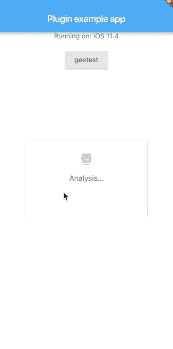

[](https://pub.dartlang.org/packages/geetest_plugin) [](https://travis-ci.com/cikichen/flutter_geetest_plugin)

# geetest_plugin

Geetest Flutter plugin.

## Screenshot



## Getting Started

Basic function version, waiting for iteration.

## Use this package as a library

### 1. Depend on it

Add this to your package's pubspec.yaml file:

```
dependencies:
  geetest_plugin: ^0.0.8
```

### 2. Install it

You can install packages from the command line:

with Flutter:

```
$ flutter packages get
```

Alternatively, your editor might support flutter packages get. Check the docs for your editor to learn more.

### 3. Import it

Now in your Dart code, you can use:

```
import 'package:geetest_plugin/geetest_plugin.dart';
```

## USAGE

```
  Future<void> getGeetest() async {
    String result;
    // Platform messages may fail, so we use a try/catch PlatformException.
    try {
      result = await GeetestPlugin.getGeetest('url: api1');
    } on PlatformException {
//      _json = 'Failed to get platform version.';
    }

    // If the widget was removed from the tree while the asynchronous platform
    // message was in flight, we want to discard the reply rather than calling
    // setState to update our non-existent appearance.
    if (!mounted) return;

    setState(() {
      _json = result;
    });
  }
 ```

 ## FAQ: 

 1. [!] The 'Pods-Runner' target has transitive dependencies that include static binaries:

 commenting out `use_frameworks`